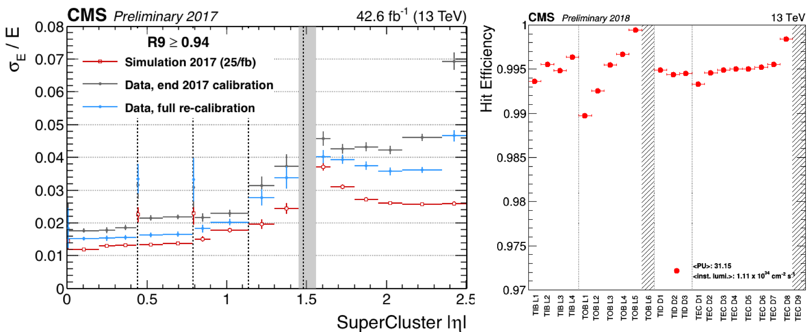

# Fonctionnement durant le run 2 du LHC

Le groupe CMS de l'IPNL est fortement impliqué dans les mises en oeuvre, calibrations et performance des détecteurs de traces (Tracker) et du calorimètre electromagnétique (ECAL). 

Du coté du Tracker, le fait marquant de son histoire a été le remplacement intégral du détecteur de vertex (pixels) avec l'ajout d'un disque et d'une couche. L'IPNL a joué un rôle crucial dans la conception et la mise en œuvre 
du nouveau système bi-phase CO2 de refroidissement, constituant un changement majeur de technologie. Il a été intégré avec succès et n'a souffert d'aucune défaillance après près de deux ans en production. Le groupe lyonnais a également mesuré la structure du détecteur à pixels à l'aide des interactions nucléaires qui a fait l'objet de la 800ème publication de CMS (JINST 13 (2018) P10034).
Par ailleurs, l'IPNL a eu au cours de ces dernières l'année l'entière responsabilité de la calibration, alignement et simulation du detecteur de traces à pistes. Ce détecteur, inchangé depuis le début de l'histoire du LHC  toujours une efficacité supérieure à 95% bien que les conditions du LHC (luminosité) soit bien au delà des exigences originales. 

Le calorimètre électromagnétique (ECAL) a également pris des données dans de très bonnes conditions au cours du run 2, grâce aux nombreuses améliorations apportées au matériel et logiciels de prise de données, qui ont été renforcées en ce qui concerne les erreurs frontales induites par les radiations. 
La plupart des maillons de la chaîne de travail nécessaires au calcul ses différentes calibrations ont été automatisés et les programmes de surveillance ont été optimisés afin de suivre de près l'échelle d'énergie du calorimètre et de fournir des calibrations pour le traitement rapide des données de CMS. Le groupe de l'IPNL est en charge d'importantes responsabilités au sein de l'organisation de ce detecteur : en particulier dans la coordination technique et la responsabilité des bases de données de calibration. 

*Fig 1: Gauche: Résolution en énergie pour les électrons du calorimètre/ Droite : Efficacité de collections des impacts du détecteur de traces*

L'expertise de l'IPNL sur les détecteurs actuellement en fonctionnement au sein de l'expérience CMS est absolument cruciale pour garantir l'excellence des données pour les analyses de physique d'aujourd'hui, ainsi que pour inventer et developper les détecteurs de demain. 